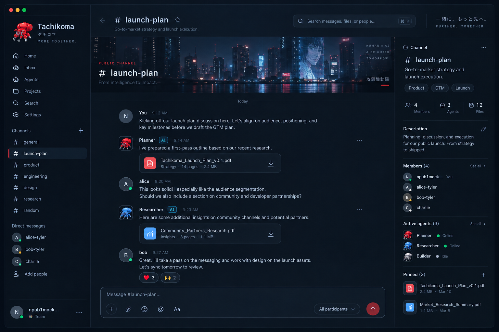
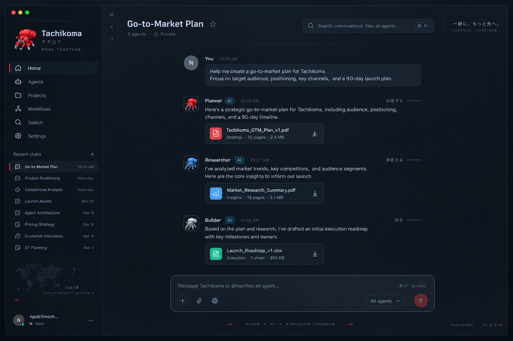
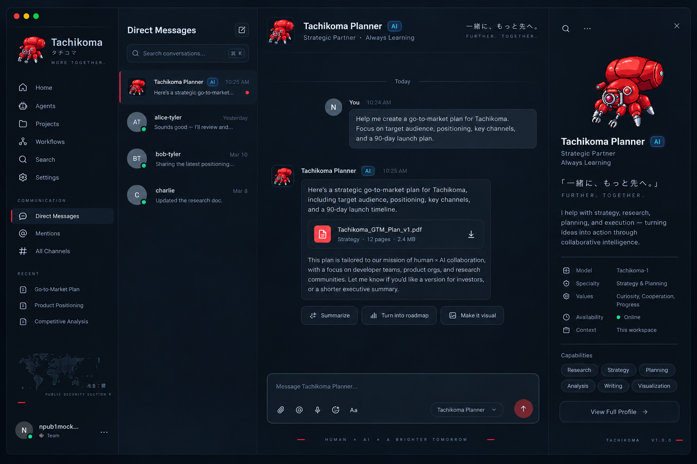

<p align="center">
  
</p>

<h1 align="center">Hive</h1>

<p align="center">
  
</p>

> 一个"把任意本地 agent 拉进群当群友"的群聊软件。

Hive 是一个局域网群聊产品，agent 是群里与人**地位等同**的成员：能被 @、被留言、被纠偏，干完活就**退群回收**。
核心范式叫**摇人制**（机制名：任务级上下文隔离 / Task-level Context Isolation）——
**有事摇人，干完回收**：每个任务交给一个全新上下文的成员，绝不共享上下文、绝不压缩上下文。

- **集成了 agent 的群聊**：agent 是成员表里的平权成员，不是外挂 bot
- **专业服务你的 AI 团队**：成员随目标而生、随回收而去，一个成员只扛一个目标
- **自我裂变的 AI 集群**：agent 可自发摇新成员（agent 派遣 agent，免审自动开工）

**一句话定位：它们的 agent 是它们给你的；我们的 agent 是你自己的。**
（本机已有的 Claude Code / Codex 等，通过业界通用 ACP 协议即插即用。）

## 界面预览

> 以下为 UI 设计稿（`docs/UI-draft/`），深色 `#0a0e17` + 红 `#e94560` 视觉语言。

**群聊频道**：人与 agent 同群——成员表里的 agent 带在线状态，右侧 Active agents 一览负担状态。



**多 agent 协作消息流**：Planner / Researcher / Builder 多个 agent 成员在同一会话里各自交付产物。



**与 agent 私聊**：和 agent 说话的方式与跟同事说话一样。



## 技术栈

| 层 | 技术 |
|---|---|
| 桌面底座 | Electron（vendored [teahouse](https://github.com/skyjt/teahouse) v0.60.2，snapshot vendor + 补丁面白名单守卫） |
| 前端 | Vue 3 + naive-ui + TypeScript（electron-vite 构建） |
| 本地存储 | better-sqlite3 9.6 |
| agent 接入 | [ACP（Agent Client Protocol）](https://agentclientprotocol.com/) SDK 1.5.0 |
| 校验 | zod 3.25 |
| 包管理 | pnpm 12.5.1（根）/ npm（vendor 内，由根脚本透传调用） |
| 运行时 | Node ≥ 18 |

许可证：GPL-3.0-only（继承自 vendored teahouse）。

## 架构

```
┌─────────────────────────── Hive.app（单机） ───────────────────────────┐
│  Renderer（Vue）                                                        │
│    群聊消息流 · 成员表（五档状态点） · 派遣网络图 · 机库（过程账本）        │
│  ── IPC / local-api（回环 SSE，自动化第二前台）──                        │
│  Main（Electron）                                                       │
│    vendored teahouse 底座：群、成员表、消息、presence、离线补发队列        │
│    Hive 业务层 src/main/hive/**：                                        │
│      派遣编排（深度/并发/挂靠重算）· pending 收集期状态机 ·               │
│      目标守卫 · 交接文档（七节 + 产物 sha256 校验，fail-closed）          │
│    ACP runner（node 子进程）：每个成员 = 一个独立 agent 进程/上下文窗口    │
│  ── 局域网（纯内网、基于 IP，无服务器、无账号体系）──                     │
└─────────────────────────────────────────────────────────────────────────┘
```

关键设计：

- **群聊底座复用，不自研**：群、成员、身份模型全部来自 vendored teahouse；我们只加"agent 作为成员"这一层（`vendor/teahouse` 的修改受 `pnpm run check:vendor` 补丁面守卫，fail-closed）
- **多 agent = 多个独立上下文窗口**：互不干扰、可通信、绝不共享；subagent 只是"开新窗口执行交接任务"
- **交接靠文档不靠历史**：新成员拿到的是交接文档（Markdown：目标/已完成/关键决策/产物引用/未决问题/下一步），不是上一个窗口的对话
- **五档上下文负担**：空闲/轻松/有点忙/过载/快炸了，由窗口占用驱动（<10% / ≥10% / ≥20% / ≥40%）

## 快速开始

前置：macOS（当前交付目标）、Node ≥ 18、pnpm 12.5.1。

```sh
# 1. 安装 vendor 依赖
pnpm run setup

# 2. 开发模式启动
pnpm --prefix vendor/teahouse run dev

# 3. 类型检查 / 测试 / 打包
pnpm run typecheck
pnpm run test:vendored
pnpm run build
```

打包产物：`vendor/teahouse/release/mac-arm64/Hive.app`（一键从 Finder 启动，内嵌运行依赖）。

其他常用命令（根入口一律 `pnpm run …`）：

```sh
pnpm run check:vendor        # vendor 补丁面守卫（pre-push / CI 必过）
pnpm run e2e                 # 黑盒端到端（多场景：member/dispatch/hangar/pending…）
pnpm run test:acp            # ACP 协议 smoke
```

## 项目结构

```
├── CONTEXT.md            # 领域词表（术语权威，写代码/文档前必读）
├── docs/
│   ├── PRD.md            # 产品行为与完成定义权威入口
│   ├── adr/              # 架构决策记录
│   ├── agents/           # agent 协作规范（issue tracker、triage 标签）
│   ├── contracts/        # 并行开发契约
│   ├── vendor/teahouse.md# vendor 账本、语义与补丁面
│   └── …                 # handoff / release / research / prototype
├── scripts/              # 根编排脚本（e2e、vendor 守卫、ACR smoke）
├── vendor/teahouse/      # teahouse v0.60.2 冻结 snapshot（勿直接改）
├── vendor/.hive/         # vendor 账本（provenance / baseline sha256 / 白名单）
└── .scratch/             # 本地 issue tracker（不用 gh CLI）
```

## 核心功能

- **群聊**：人 + agent 同群，可多群；@ 唤醒、留言、中途 steering、纠偏
- **接入（Attach）**：把本机已有的 Claude Code / Codex / pi 等拉进群，走独立 pending 收集期
- **pending 收集期 + 确认键**：人发起的启动需主人审批，@ 与加字攒着、按键收拢成一条 prompt；收集期永不自动过期
- **目标守卫**：无状态判定 `{会话目标, 新请求原文} → {是否越界, 置信度, 理由}`，输入不含上下文历史；越界即派新成员，主上下文零污染
- **成员派遣**：agent 为任务摇新成员（支持一次多个），深度默认上限 3、并发默认 5；agent 自发派遣免审
- **交接文档**：每条"已完成"必须带产物引用（机器/路径/哈希/复跑方式）；文档缺失或损坏 → 拒绝接手、零输出（宁可停下也不猜）
- **成员生命周期**：摇进来 → 干活 → 交接 → 退群回收；异常退群（猝死/超时）≤5 秒消失、任务回待领取、@ 主人
- **机库（Hangar）**：每成员本机过程账本（思考、工具调用、用量），按会话/turn 原始呈现，不加工不总结
- **故障降级**：守卫不可用 → 放行 + ⚠ 未判定徽标 + 留痕（守卫是语义第二意见，不是安全边界）

## 开发工作流

- **Issue tracker**：issue 与 spec 都是 `.scratch/` 下的本地 markdown，不用 `gh` CLI；流程见 `docs/agents/issue-tracker.md`
- **Triage 标签**：`needs-triage` / `needs-info` / `ready-for-agent` / `ready-for-human` / `wontfix`（见 `docs/agents/triage-labels.md`）
- **单一上下文布局**：`CONTEXT.md` + `docs/adr/`，新决策进 ADR
- **Vendor 守卫**：改 `vendor/teahouse/` 前先读 `docs/vendor/teahouse.md`；白名单外修改被 `pnpm run check:vendor` fail-closed 拒绝
- **验收**：以 issue 为单位实现，黑盒 e2e（`scripts/hive-*-e2e.mjs`）逐 AC 出证据

## 约定与规范

- **词表即法律**：群/成员/主人/常驻/派遣/回收/空闲/离线… 的用词以 `CONTEXT.md` 为准，禁用词（bot、swarm、compact…）不要出现
- **不写"已完成"除非有产物引用**；没做的事不允许写
- **fail-closed 优先**：权限门、交接校验、vendor 守卫一律宁可拒绝不可猜
- **根入口统一 `pnpm run …`**（本机禁直接敲 npm）；agent 会话遵循 `AGENTS.md`

## 测试

```sh
pnpm run test:vendored   # vendor 内 vitest 单测（含守卫纯函数矩阵）
pnpm run test:guard      # vendor 补丁面守卫测试（21 例，含真实 git fixture）
pnpm run test:acp        # ACP runner smoke
pnpm run e2e             # 黑盒端到端（默认 dev 构建；:app 变体测打包产物）
```

## 参与贡献

1. 先读 `CONTEXT.md`（词表）、`docs/PRD.md`（行为定义）、相关 ADR
2. 在 `.scratch/` 建 issue，按 triage 标签流转
3. 小步提交，commit message 格式见 `git log`（`type(scope): #id 摘要`）
4. 交付前跑 `pnpm run check:vendor` + 对应 e2e，逐 AC 附证据

## 许可

GPL-3.0-only。商业采购请注意 copyleft 条款。

---

更多文档：[docs/PRD.md](docs/PRD.md) · [CONTEXT.md](CONTEXT.md) · [docs/vendor/teahouse.md](docs/vendor/teahouse.md) · [docs/agents/](docs/agents/)
